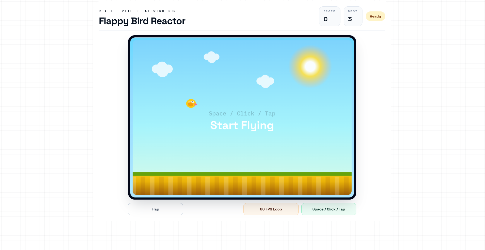

# Flappy Bird

A Flappy Bird-style browser game built with React, Vite, Tailwind CSS via CDN, and HTML5 Canvas.

🔗 **Live Demo:** [flappy-bird-k3wa.vercel.app](https://flappy-bird-k3wa.vercel.app)

## Demo



## Features

- Bird movement with gravity and flap mechanics
- Keyboard, mouse click, and touch input support
- Infinite pipe generation with random gap positions
- Real-time score system
- Persistent best score via `localStorage`
- Pipe and ground collision detection
- Game over and instant restart flow
- Canvas-based rendering with HUD
- Responsive layout for desktop and mobile

## Tech Stack

- React
- Vite
- Tailwind CSS (CDN)
- HTML5 Canvas

## Getting Started

```bash
npm install
npm run dev
```

| Command | Description |
|---|---|
| `npm run dev` | Start development server |
| `npm run build` | Build for production |
| `npm run preview` | Preview production build |

## Controls

| Input | Action |
|---|---|
| `Space`, `↑`, `W`, `Enter` | Flap |
| Mouse click / Touch tap | Flap |
| `R` | Restart |

## Gameplay

- The bird falls continuously due to gravity
- Each flap pushes the bird upward
- Pipes move from right to left
- Passing a pipe gap scores `+1`
- Hitting a pipe or the ground ends the game

## Project Structure

```
flappy-bird/
├── index.html
├── package.json
├── vite.config.js
└── src/
    ├── App.jsx
    ├── main.jsx
    └── index.css
```
